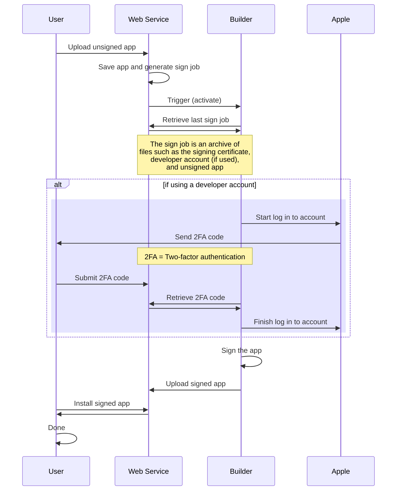

# How does this all work?

This project is not one simple program. It is a combination of a web service and a builder, which work together to achieve signing and sideloading.

Below is a rough [sequence diagram](https://en.wikipedia.org/wiki/Sequence_diagram) of how the entire process works. If you haven't read a diagram like this before, it essentialy describes interactions between different parties. In this case, we have four parties: the User, Web Service, Builder, and Apple. Start reading the diagram from the top and make your way to the bottom. Each vertical line is a party, while each horizontal line is an interaction. The big rectangle labeled `alt - if using a developer account` will only be executed if you are signing with a developer account. Otherwise, it is skipped.

