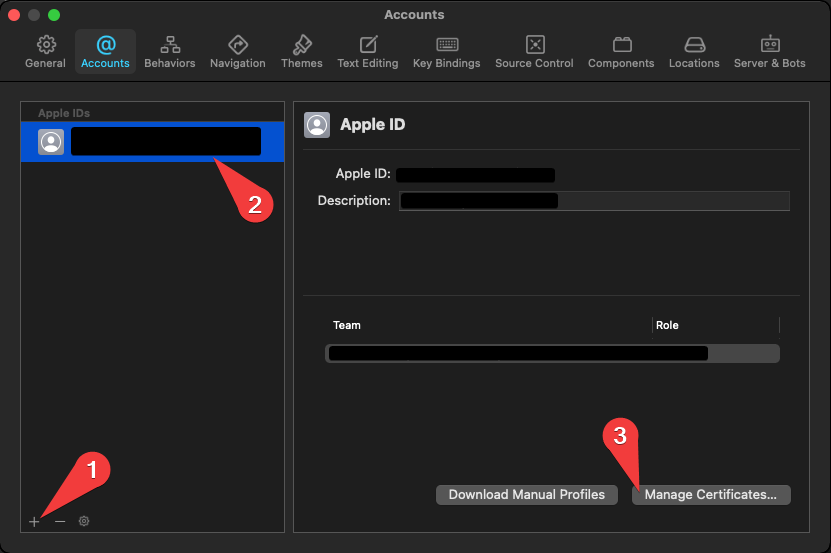
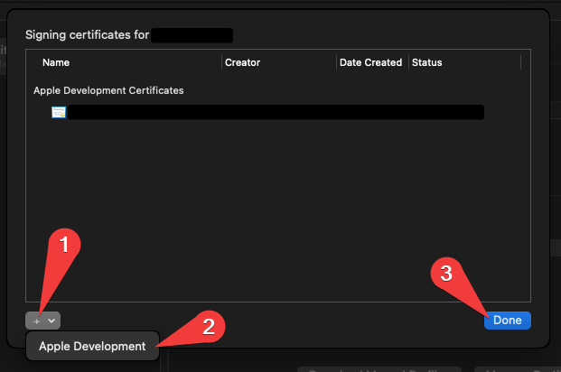
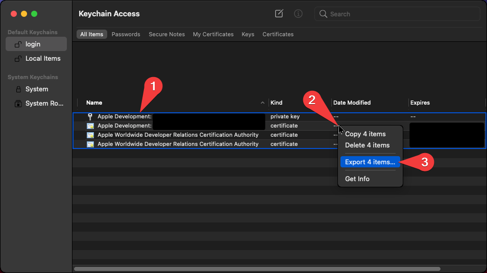

# Simple Installation

## 1. Limitations

This installation guide uses [Railway](https://railway.app/) to host your signing service for free. The free plan has several limitations that you should be aware of:

- You can only run your service for 500 hours per month (20 days). After that, your service will be disabled until the start of the next month.
- You only have 1GB of guaranteed disk space (although at the moment, up to 10GB are actually usable).
- Your GitHub account must be at least 90 days old or you must verify your identity by entering a credit card.

You can work around the first limit by turning off your service from Railway when not in use.

You can also avoid these limits altogether by adding your credit card to Railway and enabling the "Developer Plan", but this may end up costing your money, depending on your usage. You get \$5 of free credits every month, and you are charged in real time based on CPU and RAM usage. If SignTools is idling, you are using virtually zero CPU, while the RAM stays within reasonable amounts to keep the monthly cost below \$5. The disk space is raised to 100GB on this plan and there is no run time limit. Only try this at your own risk, and be prepared to pay real money if your usage exceeds the free credits!

For more information, check their [pricing page](https://railway.app/pricing).

## 2. Builder

You will have to create a builder. Currently, only GitHub Actions is supported. Head over to [SignTools-CI](https://github.com/SignTools/SignTools-CI) and follow the **GitHub Actions** instructions.

Once you have made your builder, proceed below.

## 3. Signing profile

You need a signing profile to be able to sign apps. A signing profile is simply a collection of files and credentials that Apple provides to developers so they can sign apps.

There are two types of signing profiles:

- **Developer account**

  This method works for both free and paid developer accounts. You only need your Apple account's name and password. You will likely be prompted for a 6-digit code every time you sign an app, which you can submit on the service's web page. This method will be able to use most entitlements, resulting in working app extensions and iCloud synchronization. There are no restrictions if you have a paid account. If you have a free account, make sure you read and understand the limitations in the [FAQ](FAQ.md#free-developer-account-limitations) page.

- **Custom provisioning profile**

  If you have a provisioning profile with a `.mobileprovision` extension, you can use this method as well. There is no 6-digit code, so signing will be faster than a developer account. However, based on the type of your provisioning profile, different entitlements and features may not work on your signed apps. For the differences, check the [FAQ](FAQ.md#what-kind-of-certificatesprovisioning-profiles-are-supported) page.

Additionally, you will also need a certificate archive with a `.p12` extension. It must contain at least one certificate and at least one private key. If you need development entitlements, add an `Apple Development` certificate and its key. If you need distribution entitlements, add both an `Apple Development` and `Apple Distribution` certificate, along with their keys. For the differences, check the [FAQ](FAQ.md#what-kind-of-certificatesprovisioning-profiles-are-supported) page.

If you are using a custom provisioning profile, you likely received a certificate archive along with it — use that. If you have a developer account, you can create one from the [developer portal](https://developer.apple.com/account/resources/certificates/list). Otherwise, follow the instructions below:

- **macOS**

  Install [Xcode](https://developer.apple.com/xcode/) and open the `Account Preferences` (A). Sign into your account using the plus button. Select your account and click on `Manage Certificates...`. In the new window (B), click the plus button and then `Apple Development`. Click `Done`. Now open the `Keychain` app (C). There you will find your certificate and private key. Select them by holding `Command`, then right-click and select `Export 2 items...`. This will export you the `.p12` file you need.

  <table>
  <tr>
      <th>A</th>
      <th>B</th>
      <th>C</th>
  </tr>
  <tr>
      <td></td>
      <td></td>
      <td></td>
  </tr>
  </table>

- **Windows**

  There is no official way to do this. However, you can use [altserver-cert-dumper](https://github.com/SignTools/altserver-cert-dumper) with [AltStore](https://altstore.io/) as a workaround. Note that you are doing so at your own risk.

## 4. Web service

Register for an account at [Railway](https://railway.app/) and log in.

Then, click on the button below, and grant the Railway app access to your builder repo in GitHub if prompted. When you reach the SignTools template page, tick `Private repository`, make any changes if necessary, and fill in the fields by reading their descriptions:

Once you are done, a new page will open and you will see an entry under `Deployments` on the right side of the screen — first it will be gray, then blue, and finally green. This process can take up to 5 minutes. Once the entry becomes green, you will see your service's public URL, for example: `signtools-production-ddc0.up.railway.app`. Use this URL to connect to your newly deployed service. Congratulations!

## 5. Managing the service

On the free plan, you only have 500 hours (20 days) of run time every month, after which your service will be disabled until the next month. To work around this limit, either delete the service from within Railway when you are done using it, or alternatively, click on the service in your dashboard, go to `Variables` in the pane on the right side of the screen, and set `BUILDER_GITHUB_ENABLE` to `false`. Doing so will cause the service to crash and turn off, effectively pausing your free hours. Once you are ready to start it again, simply set the variable back to `true`, and the app will run again.

If you want to avoid these limits altogether, but risk having to pay, enable the "Developer Plan" as detailed in the first section.

## 6. Troubleshooting

Check out the [FAQ](FAQ.md) page.
