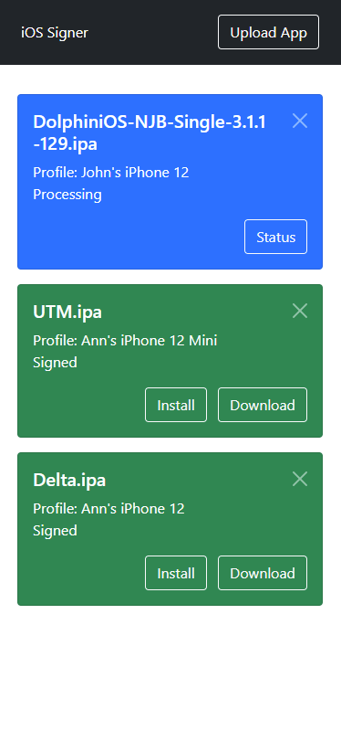
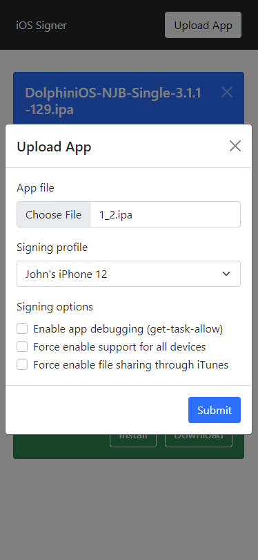

    
    <h1 align="center">SignTools</h1>
    

        A free, self-hosted platform to sign and install iOS apps without a computer *
    

    

        
        
        
        
        
        
    

## Introduction

SignTools is a sideloading platform that takes a different approach from any similar tools. It consists of two components — a **service** and a **builder**. The builder is a macOS machine which performs signing using official Apple software. Doing so means high reliability and compatibility. The service (this repo) can be hosted anywhere, and it provides a web interface for you to upload, sign, and download apps, using the builder where necessary. Having the web service means that you don't need anything installed on your phone, and you can still sideload without a computer *.

Don't be discouraged if this sounds complicated — **you don't need to own a Mac or a server**, and the **simple setup takes less than 5 minutes**! Read ahead for more information and examples.

## :raised_hands: Community

Come join the official Discord to get more interactive support and have general conversations about this project: https://discord.gg/A4T6npnRCk

## Disclaimer

This project is self-hosted; there is no public service. It does not provide any alternative catalog of apps. This project does not provide, promote, or support any form of piracy. This project is aimed solely at people who want to install homebrew apps on their device, much like the popular [AltStore](https://github.com/rileytestut/AltStore). We (all collaborators) cannot be held liable for anything that happens by you using this project.

## Features

- No jailbreak required
- iOS, iPadOS, macOS (M1) supported
- No computer required after an initial setup \*
- Minimalistic, mobile-friendly web interface
- Upload unsigned apps, download signed apps
- Inject tweaks as you are signing apps
- Install signed apps from the website straight to your iOS device via [OTA](https://medium.com/@adrianstanecki/distributing-and-installing-non-market-ipa-application-over-the-air-ota-2e65f5ea4a46) \*
- Provisioning profiles, paid and free developer accounts supported
- Every possible signing method supported, including entitlements \*
- Choose from multiple signing profiles for each app

\* Free developer accounts require a computer to install apps and some entitlements will not work. Check out the [FAQ](FAQ.md).

## Screenshots

<table>
<tr>
    <td>
        
        
    </td>
</tr>
</table>

## Installation

There are multiple ways to install this web service:

- ### [Simple](INSTALL-SIMPLE.md) — on a free Heroku server

- ### [Advanced](INSTALL-ADVANCED.md) — on your own machine

## [Frequently Asked Questions (FAQ)](FAQ.md)

## License

This project and all of its unlicensed dependencies under the [SignTools](https://github.com/SignTools) organization are licensed under AGPL-3.0. A copy of the license can be found [here](LICENSE). Raise an issue if you are interested in exclusive licensing.
