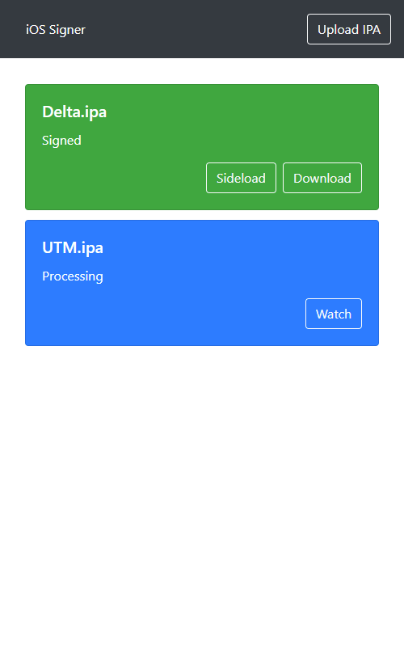
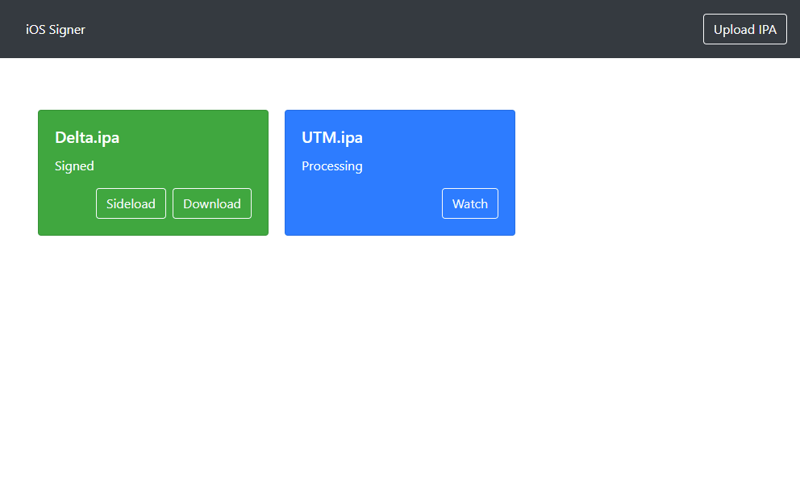

# iOS Signer Service

> A cross-platform, self-hosted service to sign iOS apps using GitHub CI

## Introduction

Apple does not allow installing unsigned apps on iOS.
At the same time, the only allowed app source, the App Store, does not accept each and every app.
What happens if you want to install an app that is not available on the App Store? Or what if you want to install your own app without having to publish it? Sure, there is free developer signing, but it is riddled with restrictions that make the app unsuitable for daily use.

Enter `ios-signer-service` - a cross-platform, self-hosted web service to sign and install any iOS app on your iOS device.

**NOTICE**: You **MUST** have a valid **signing certificate** and **provisioning profile**, which is usually not free. This project does not help you install apps for free.

## Features

- No macOS system required at any point
- After set up, no computer ever required
- Minimalistic, mobile-friendly web interface
- Upload unsigned app and have it signed
- Download signed app
- Install signed app straight to your iOS device via [OTA](https://medium.com/@adrianstanecki/distributing-and-installing-non-market-ipa-application-over-the-air-ota-2e65f5ea4a46)
- Periodic old file cleanup

## Screenshots

<table>
<tr>
    <th>Web</th>
    <th>Desktop</th>
</tr>
<tr>
    <td></td>
    <td></td>
</tr>
</table>

## Installation

### Requirements

- A HTTP-enabled server, can be any platform
- A GitHub account
- Signing certificate (.p12 file)
- Provisioning profile (.mobileprovision file)

### Process

This project consists of two sub-projects:

- [ios-signer-service](https://github.com/SignTools/ios-signer-service) (this repo)
- [ios-signer-ci](https://github.com/SignTools/ios-signer-ci)

`ios-signer-service` is a web service that you install on any server that offers HTTPS. The service exposes a web interface which allows the user to upload "unsigned" app files. The easiest way to install the service is using the [Docker image](TODO).

Uploaded "unsigned" app files are sent from `ios-signer-service` to `ios-signer-ci` for signing. This offloading is necessary because signing is only supported on a macOS system. `ios-signer-ci` uses GitHub's CI, which offers a macOS environment, to sign the file, and then sends it back to `ios-signer-service`. Finally, the user is able to download or install the signed app from the same web interface where they uploaded it. To host your own `ios-signer-ci`, simply fork the repo and follow its README.
