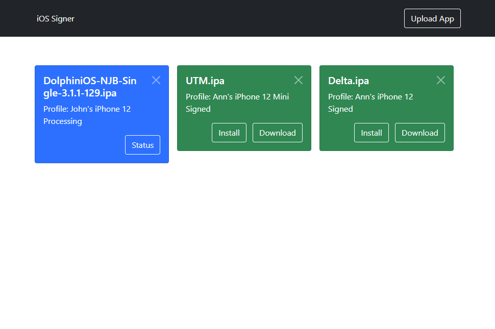
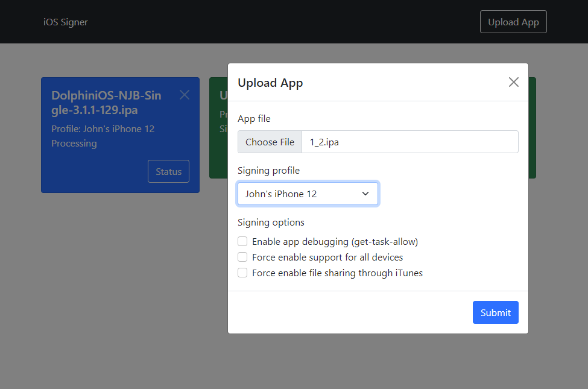

    
    <h1 align="center">iOS Signer Service</h1>
    

        A self-hosted, cross-platform service to sign and install iOS apps, all <b>without a computer</b>.
    

    

        
        
        
        
        
        
    

## Introduction

There are many reasons to install apps outside Apple's App Store. Unfortunately, this process is severely hindered by Apple and unrealistic for the average user. This is where iOS Signer Service comes to the rescue. No more terminal, no more computer. Sideload any app directly from your phone through a simple web interface.

What's the catch? The workflow uses a separate macOS machine, called a "builder", to perform the signing. This project is only a web service which controls the builder, along with a web interface for you to upload unsigned apps and download signed apps. However, **you don't need to own a Mac** - the builder can be any **free** CI (Continuous Integration) provider or even your own machine. The web service can be hosted on any computer or **even your phone**.

More information and examples can be found in the installation section.

## :rocket: Free developer accounts

As of v2.0.0 this service now supports **free developer accounts**! Although with some [severe limitations](FAQ.md), this is a huge milestone not only for the project but for the sideloading community as a whole. The signing process is achieved **without any** reverse engineering or third-party tools - only Apple's very own operating system and developer tools are used, just in a clever way.

## Disclaimer

This project is self-hosted; there is no public service. It does not provide any alternative catalog of apps. This project does not provide, promote, or support any form of piracy. This project is aimed solely at people who want to install homebrew apps on their device, much like the popular [AltStore](https://github.com/rileytestut/AltStore). We (all collaborators) cannot be held liable for anything that happens by you using this project.

## Features

- No jailbreak required
- All iOS versions supported
- No computer required at all
- Minimalistic, mobile-friendly web interface
- Upload unsigned apps, download signed apps
- Install signed apps from the website straight to your iOS device via [OTA](https://medium.com/@adrianstanecki/distributing-and-installing-non-market-ipa-application-over-the-air-ota-2e65f5ea4a46)
- Choose from multiple signing profiles or free developer accounts
- Configure various aspects of the signing process
- Periodic old file cleanup

## Screenshots

<table>
<tr>
    <th>Mobile</th>
    <th>Desktop</th>
</tr>
<tr>
    <td>
        
        
    </td>
    <td>
        
        
    </td>
</tr>
</table>

## [Installation](INSTALL.md)

## [Frequently Asked Questions (FAQ)](FAQ.md)

## License

This project and all of its unlicensed dependencies under the [SignTools](https://github.com/SignTools) organization are licensed under AGPL-3.0. A copy of the license can be found [here](LICENSE). Raise an issue if you are interested in exclusive licensing.
